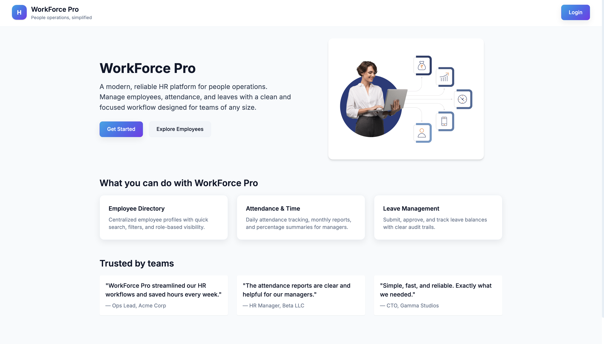

# WorkForce Pro — HRMS 

AI-powered Human Resource Management System built for the FWC Hackathon.



## Features

- Authentication & Role-Based Access Control
- Employee Management
- Attendance Tracking
- Leave Management
- AI Resume Screening
- AI Interview Bot
- HR Copilot Assistant
- Performance Review Generation

## Tech Stack

Frontend: React, Vite, Tailwind CSS  
Backend: Flask, SQLAlchemy, JWT  
Database: PostgreSQL  
AI: Google Gemini API

## Roles

- Admin
- HR Recruiter
- Manager
- Employee

## Demo Credentials

| Role | Email | Password |
|--------|--------|----------|
| Admin | admin@hrms.com | admin123 |
| HR | hr@hrms.com | hr123 |
| Manager | manager@hrms.com | manager123 |
| Employee | employee@hrms.com | employee123 |

## Setup

### Backend

```bash
cd backend
pip install -r requirements.txt
python run.py
```

### Frontend

```bash
cd frontend
npm install
npm run dev
```

Built for the FWC AI/ML Full Stack Hackathon.
